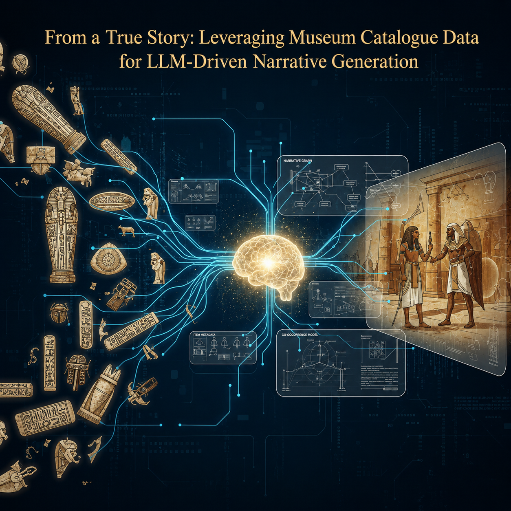

# From a True Story: Leveraging Museum Catalogue Data for LLM-driven Narrative Generation

This repository contains the code for the paper "From a True Story: Leveraging Museum Catalogue Data for LLM-driven Narrative Generation."

## Structure

- `story_generation/`: code for the story generation pipeline.
- `llm_as_story_judge/`: code for the LLM-based evaluation (the "story judge").
- `datasets/`: contains the stories produced by running the story generation pipeline.
- `visualization_tool/`: allows users to explore the generated stories and dramatic situations descriptions.

## Datasets

The `datasets/` folder contains three datasets:

- `polti_guided_structured_narratives.json`: stories generated by running the full story generation pipeline.

- `comparable_baseline_structured_narratives.json`: stories generated from the same narrative units selected for the full pipeline, but without including the explicit `dramatic_situation` field in the generation step.

- `high_potential_structured_narratives.json`: stories generated from the top 100 narrative units ranked solely by storytelling potential, without filtering them according to their adherence to Polti’s dramatic situations.

## License

This project is licensed under the Creative Commons Attribution 4.0 International License (CC BY 4.0).
See: https://creativecommons.org/licenses/by/4.0/